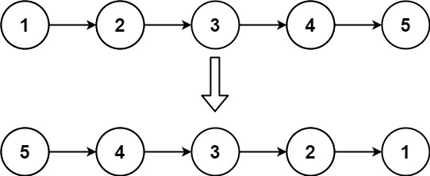
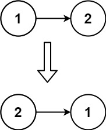

# [206. Reverse Linked List][question-link]

Given the head of a singly linked list, reverse the list, and return the reversed list.

### Example 1:


```text
Input: head = [1,2,3,4,5]
Output: [5,4,3,2,1]
```

### Example 2:


```text
Input: head = [1,2]
Output: [2,1]
```

### Example 3:
```text
Input: head = []
Output: []
```

### Constraints:

* The number of nodes in the list is the range [0, 5000].
* -5000 <= Node.val <= 5000

### Follow up:

A linked list can be reversed either iteratively or recursively. Could you implement both?

[question-link]: https://leetcode.com/problems/reverse-linked-list/?envType=study-plan-v2&envId=leetcode-75