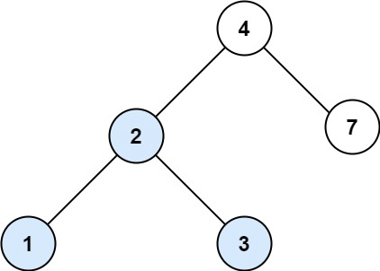
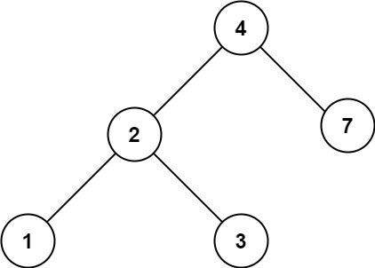

# [700. Search in a Binary Search Tree][question-link]

You are given the root of a binary search tree (BST) and an integer val.

Find the node in the BST that the node's value equals val and return the subtree rooted with that node. If such a node does not exist, return null.

### Example 1:

```text
Input: root = [4,2,7,1,3], val = 2
Output: [2,1,3]
```

### Example 2:

```text
Input: root = [4,2,7,1,3], val = 5
Output: []
```

### Constraints:

* The number of nodes in the tree is in the range [1, 5000].
* 1 <= Node.val <= 107
* root is a binary search tree.
* 1 <= val <= 107

[question-link]: https://leetcode.com/problems/search-in-a-binary-search-tree/?envType=study-plan-v2&envId=leetcode-75